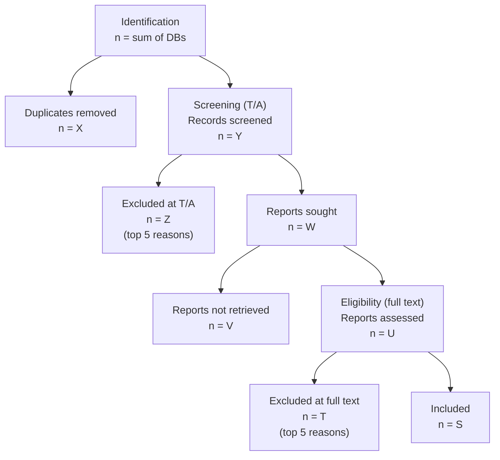

# PRISMA screening workflow

Two-pass article selection that feeds the data-extraction phase.
Lives under `project-review/<name>/screening/` and is driven by three
slash commands + two screener sub-agents. Fully PRISMA 2020 compliant
(the flowchart is auto-rendered from the decision CSVs).

```
                          /wiki-screen-init <name>
                                   │
                                   ▼
              screening/criteria.md  (PICO + IN/OUT criteria)
                                   │
       user drops CSV exports  →   screening/identified/*.csv
       user authors primer     →   background/notes.md (optional)
                                   │
                                   ▼
                       /wiki-screen-tiab <name>
            ┌──────────────────────┼──────────────────────┐
            │                      │                      │
        dedupe                fetch missing            screen T/A
   (screen_dedupe.py)        abstracts (cascade)    (screener-tiab)
                                                          │
                                                  reads background/notes.md
                                                  if present, then decides
                                                          │
            └──────────┬───────────┴──────────┬───────────┘
                       │                      │
                       ▼                      ▼
                screening/dedup.csv    screening/tiab-decisions.csv
                                              │   (decision + reason + side_use)
                                         fetch_oa.py
                                              │
                                              ▼
              screening/1st-pass/{raw,markdown}/ + missing.md
                                              │
                  user fetches paywalled PDFs manually
                                              │
                                              ▼
                       /wiki-screen-fulltext <name>
                                              │
                                     screener-fulltext
                                  (reads background/notes.md
                                   + criteria.md + the body)
                                              │
                                              ▼
                       screening/fulltext-decisions.csv
                                              │   (decision + reason + side_use)
                          ┌───────────────────┴───────────────────┐
                          │                                       │
              copy included MDs into                  copy side-flagged excludes into
                          ▼                                       ▼
       extraction/articles/<slug>.md         extraction/biblio/side/<category>/<slug>.md
                          │                                       │
                          ▼                                       │
                       /wiki-extract-table  (existing pipeline)   │
                          ◄───────────────────────────────────────┘
                       (side refs ready to cite in the review)
```

The PRISMA flowchart at `screening/reports/prisma-flowchart.md` is
regenerated from disk at every checkpoint — counts are deterministic,
never hand-maintained.

---

## When to use this workflow

- You're starting a **systematic / scoping / mapping review** and need
  a PRISMA-compliant selection step before extraction.
- You exported the candidate list from one or more databases (PubMed,
  Scopus, Web of Science, Embase, …) as CSV.
- You want the agent to do the first pass (T/A) and a structured
  second pass (full text) with verbatim evidence per exclusion.

Skip this workflow if you already have a fixed list of slugs to
extract — go straight to `/wiki-extract-table`.

---

## Inputs

Drop **CSV exports** into
`project-review/<name>/screening/identified/`. One CSV per source
database (the filename becomes the `source_db` tag in the dedup).

Expected columns (case-insensitive; all optional except `title`):

| Column     | Aliases                                                |
|------------|--------------------------------------------------------|
| `title`    | `Title`, `article_title`, `ti`                         |
| `authors`  | `Authors`, `author`, `au`                              |
| `year`     | `publication_year`, `py`, `pub_year`                   |
| `doi`      | `DOI`                                                  |
| `pmid`     | `pubmed_id`                                            |
| `abstract` | `Abstract`, `ab`                                       |
| `journal`  | `source`, `jt`, `venue`                                |
| `source_db`| `Database`, `db` — auto-filled from filename if absent |

Any extra columns are preserved verbatim under their original header
in `dedup.csv` (prefixed `extra__`).

---

## Pass 1 — Title / Abstract

### Step 1 — Deduplicate

```bash
python tools/screen_dedupe.py project-review/<name>
```

Identifier priority (highest wins):

1. **DOI** — normalized (strip `https://doi.org/`, lowercase)
2. **PMID** — digits only
3. **Fuzzy** (when DOI and PMID are both empty) — normalized title +
   first-author lastname + year, SequenceMatcher ratio ≥ 0.92 on the
   title

Output: `screening/dedup.csv` + `screening/reports/dedup-log.md`.
Each record is assigned a `slug` of the form `<first-author>-<year>`
(collision-suffixed). Slugs are stable across re-runs of the same
inputs.

Pass `--strict` to skip fuzzy matching (DOI + PMID only).

### Step 2 — Fetch missing abstracts

```bash
python tools/screen_fetch_metadata.py project-review/<name>
```

Cascade per record (stops at first success):

1. **PubMed E-utilities** (when PMID is known)
2. **OpenAlex** (when DOI is known, or PMID → DOI via OpenAlex)
3. **Crossref** (when DOI is known)

Set `UNPAYWALL_EMAIL=<you@…>` in env for the polite pool (recommended).

Cached in `tools/.cache/screen_metadata.json` — keyed by `doi:<…>` or
`pmid:<…>`. Re-runs are free unless `--force`.

### Step 3 — Judge each record (LLM)

For each row of `dedup.csv`, the parent orchestrator spawns
`screener-tiab` with:
- the project's `criteria.md`
- the row's title, abstract, year, journal, authors, DOI, PMID

The sub-agent returns ONE line:

```
<decision> | <reason>
```

with `decision ∈ {include, exclude, uncertain}`. `uncertain` defaults
to **retrieve** (PRISMA practice — better over-include at T/A than
miss a study).

Results land in `screening/tiab-decisions.csv` with columns:

```
slug, doi, pmid, title, year, journal, decision, reason,
screener_note, timestamp
```

### Step 4 — User audit gate

The orchestrator forces an audit pass before fetching PDFs:
- Sample (default 10% or 20 max), all `uncertain` rows, OR all
  `exclude` rows
- Per row: `keep / flip-to-include / flip-to-exclude`
- Flips are logged in `tiab-report.md`'s `## Manual overrides` section

### Step 5 — Auto-fetch PDFs for included articles

```bash
python tools/fetch_oa.py --from-stdin \
    --output-dir project-review/<name>/screening/1st-pass/raw/ \
    < <doi-list-of-includes>
```

Uses Unpaywall under the hood. PDFs land at
`screening/1st-pass/raw/<slug>.pdf`.

Paywalled / unavailable PDFs are appended to
`screening/1st-pass/missing.md` (slug, DOI/PMID, title, suggested
manual sources). The user finishes the retrieval manually before
launching pass 2.

### Step 6 — Convert PDFs → MD (for pass 2 reading)

For every fresh PDF without a MD counterpart, the orchestrator runs
the project's conversion entrypoint (see
`docs/workflows/conversion.md`) into
`screening/1st-pass/markdown/<slug>.md`.

### Step 7 — Reports

- `screening/reports/tiab-report.md` — narrative summary, exclusion
  breakdown, manual overrides, errors
- `screening/reports/prisma-flowchart.md` — regenerated via
  `tools/screen_prisma.py`

---

## Pass 2 — Full text

### Step 1 — Determine candidates

The full-text pass operates on rows of `tiab-decisions.csv` with
`decision ∈ {include, uncertain}` AND a body available
(MD in `1st-pass/markdown/<slug>.md`).

Articles without a body are recorded with `decision = not-assessed`,
`tag = body-missing` — they show up under "Reports not retrieved" in
the PRISMA flowchart, NOT as exclusions.

### Step 2 — Judge each candidate (LLM)

For each candidate, the orchestrator spawns `screener-fulltext` with:
- the project's `criteria.md`
- the project's `contexte.md`
- the article MD path

The sub-agent reads the body in full (Methods + Results + skim of
Discussion) and returns ONE line:

```
<decision> | <tag>; "<verbatim excerpt>"; <source location>
```

(for `exclude` — `include` has empty reason; `uncertain` is rare at
full text and reserved for truncated PDFs).

The verbatim excerpt + location is mandatory for every exclusion —
that's what makes the screening auditable.

Results land in `screening/fulltext-decisions.csv` with columns:

```
slug, doi, pmid, title, decision, tag, excerpt, location,
screener_note, timestamp
```

### Step 3 — User audit gate

- Default: all `uncertain` + 10% sample of `exclude` (with the
  verbatim excerpt + location surfaced for verification)
- Per row: `keep / flip-to-include / flip-to-exclude / view-body`
- Flips logged in `fulltext-report.md`

### Step 4 — Stage included articles for extraction

For each row with `decision = include`, the orchestrator copies
`screening/1st-pass/markdown/<slug>.md` to
`extraction/articles/<slug>.md` (cp, never mv). The screening
register is preserved.

### Step 5 — Reports

- `screening/reports/fulltext-report.md` — exclusion breakdown
  grouped by criterion tag, with every verbatim excerpt
- `screening/reports/prisma-flowchart.md` — regenerated

---

## Decision rules — what each agent does

### `screener-tiab` (haiku)

- **Reads**: title, abstract, year, journal, authors, DOI/PMID +
  `background/notes.md` if present (domain primer).
  **Never** the body.
- **Defaults to over-inclusion**: when title + abstract are
  insufficient to decide, returns `uncertain` (treated as retrieve).
- **Output format**: `<decision> | <reason> | <side_use>`.
  - `<reason>` = short criterion tag from `criteria.md`
    (e.g. `wrong-population`, `not-RCT`).
  - `<side_use>` ∈ {empty, intro, discussion, method, reco, general}
    — only filled for `exclude`. Flags articles excluded from
    extraction but worth citing in the review.

### `screener-fulltext` (sonnet)

- **Reads**: the article's MD body (Methods + Results mandatory) +
  `background/notes.md` if present.
- **Never returns `uncertain`** unless the body is truncated /
  unavailable.
- **Output format**: `<decision> | <reason> | <side_use>`.
  - `<reason>` for excludes: `<tag>; "<verbatim excerpt>"; <source location>`.
  - `<side_use>` for excludes: bare category OR
    `<category>; "<quote>"; <location>` (preferred — auditable).
  - The verbatim excerpt + location is non-negotiable for the
    `<reason>` field — the parent rejects malformed responses.

Both sub-agents:
- Read `background/notes.md` at session start when present (domain
  primer authored by the user)
- Never use external knowledge to fill in what the article doesn't
  say (background notes are domain context, NOT a license to guess)
- Never invent criterion tags — tags come from `criteria.md`
- Never invent side categories — only the 5 listed are valid
- Output ONE line per invocation, parsed strictly by the orchestrator

---

## Background folder — sub-agent context

The optional `background/` folder at the project root holds the
user's domain primer:

```
project-review/<name>/background/
├── notes.md       # user-authored summary — THIS is what sub-agents read
├── raw/           # PDFs the user dropped (seminal works, prior reviews)
└── markdown/      # converted MDs (or user-dropped MDs)
```

**Only `notes.md` is consumed by the sub-agents.** It's the user's
distilled summary — under 800 words is a healthy target. Topics to
include:

- Motivation — why this review exists
- Seminal works (author-year + one-liner)
- Glossary / terminology disambiguation (e.g. what "chronic" means
  in this corpus)
- Domain priors (e.g. unit conventions, ITT preference)

The PDFs in `background/raw/` are for the user's reference only —
the sub-agents do NOT read them per invocation (cost prohibitive).
If the user wants a PDF's content to influence decisions, they
distill it into `notes.md`.

If `notes.md` is absent or empty, sub-agents skip the background
read silently and decide from criteria.md + the article alone.

---

## Side article detection

During screening, the screeners flag articles that are excluded from
the review but worth citing in it. The orchestrator copies their MD
into `extraction/biblio/side/<category>/<slug>.md` so they're
pre-organized for the writing phase.

### Categories (closed list)

| Category     | Where it gets cited in the review                                       |
|--------------|-------------------------------------------------------------------------|
| `intro`      | Introduction / motivation / background                                  |
| `discussion` | Discussion / interpretation / comparison with other interventions       |
| `method`     | Methods — validates a scale / technique used by included studies        |
| `reco`       | Clinical / practice recommendation worth citing                         |
| `general`    | Side-useful but the category is unclear                                 |

### How it flows

| Stage                  | What happens                                                                  |
|------------------------|-------------------------------------------------------------------------------|
| T/A pass (screener-tiab) | Flags side-useful excludes from abstract alone (speculative, conservative). |
| `/wiki-screen-tiab` Phase 4b | Lists speculative T/A side flags in `extraction/biblio/side/<cat>/pending.md` (no copy — no body yet). |
| Full-text pass (screener-fulltext) | Re-evaluates side-use from the body, with verbatim excerpt + location for audit. |
| `/wiki-screen-fulltext` Phase 5b   | Copies the article MD (+ PDF if present) to `extraction/biblio/side/<cat>/<slug>.md` and appends a row to `extraction/biblio/side/<cat>/index.md`. |
| User audit gate              | `set-side <cat>` / `clear-side` override the screener's category.       |

### Conservative tagging

Most excludes are NOT side-useful. The screeners are instructed to
flag only when there's a clear signal (a guideline, a methodological
validation, a high-level framing piece). False positives are cheap
(an extra MD copied) but the index.md should stay short and useful.

---

## Decision data model

### `screening/tiab-decisions.csv` (Pass 1)

| Column           | Type / values                                                           |
|------------------|-------------------------------------------------------------------------|
| `slug`           | `<first-author>-<year>`                                                 |
| `doi`            | normalized DOI (may be empty)                                           |
| `pmid`           | digits (may be empty)                                                   |
| `title`          | verbatim                                                                |
| `year`           | `YYYY`                                                                  |
| `journal`        | verbatim                                                                |
| `decision`       | `include` \| `exclude` \| `uncertain` \| `error`                        |
| `reason`         | criterion tag (e.g. `wrong-population`) or empty                        |
| `side_use`       | `intro` \| `discussion` \| `method` \| `reco` \| `general` \| empty     |
| `screener_note`  | free text from `# comment` in sub-agent output                          |
| `timestamp`      | ISO 8601                                                                |

### `screening/fulltext-decisions.csv` (Pass 2)

| Column           | Type / values                                                            |
|------------------|--------------------------------------------------------------------------|
| `slug`           | matches the T/A row                                                      |
| `doi`            | normalized                                                               |
| `pmid`           | digits                                                                   |
| `title`          | verbatim                                                                 |
| `decision`       | `include` \| `exclude` \| `uncertain` \| `not-assessed` \| `error`       |
| `tag`            | criterion tag (e.g. `wrong-design`)                                      |
| `excerpt`        | verbatim quote from the article (≤ 30 words)                             |
| `location`       | source location (`Methods §"Study design"`, `Table 1`, `p.4 §"…"`, etc.) |
| `side_use`       | `intro` \| `discussion` \| `method` \| `reco` \| `general` \| empty      |
| `side_excerpt`   | optional verbatim quote justifying the side flag                         |
| `side_location`  | optional source location for the side quote                              |
| `screener_note`  | free text                                                                |
| `timestamp`      | ISO 8601                                                                 |

---

## PRISMA 2020 flowchart

Generated by `tools/screen_prisma.py`. Reads:

- `screening/identified/*.csv`   → identified records per DB
- `screening/dedup.csv`           → after duplicates removed
- `screening/tiab-decisions.csv`  → T/A screened + excluded with reasons
- `screening/1st-pass/raw/*.pdf`  → reports retrieved
- `screening/1st-pass/missing.md` → reports NOT retrieved
- `screening/fulltext-decisions.csv` → reports assessed + included + excluded with reasons

Outputs a Mermaid flowchart + a summary table at
`screening/reports/prisma-flowchart.md`. Idempotent — re-run any time
to refresh.



---

## Hard rules (non-negotiable)

- **Two passes are physically separated.** Pass 1 NEVER reads PDFs.
  Pass 2 NEVER decides from abstract alone. The audit trail
  distinguishes which evidence drove which decision.
- **Every full-text exclusion has a verbatim excerpt + source
  location.** No naked "wrong-population" rows — `screener-fulltext`
  refuses, the orchestrator logs as `error` if it ever happens.
- **PRISMA flowchart is the source of truth for counts.**
  Regenerated from disk at every milestone. Never hand-edited.
- **`uncertain` at T/A defaults to retrieve.** The orchestrator
  fetches the PDF and the full-text pass decides. The user can
  override at the audit gate.
- **Included articles are COPIED, never moved.** The screening
  register (PDFs in `1st-pass/raw/`, MDs in `1st-pass/markdown/`)
  stays intact even after extraction starts.
- **Side-flagged articles are COPIED, never moved.** Same rule —
  `screening/1st-pass/` is the authoritative source; everything
  else is a copy for portability.
- **`background/notes.md` is read by sub-agents BUT NEVER overrides
  `criteria.md`.** The notes are domain context; eligibility is
  decided by criteria. A criterion-violating article is excluded
  even if the notes might suggest it's "important to the field".

---

## Re-running, idempotency, recovery

| Action                                | Safe to re-run? |
|---------------------------------------|-----------------|
| `screen_dedupe.py`                    | Yes — overwrites `dedup.csv`, deterministic |
| `screen_fetch_metadata.py`            | Yes — cached, only fetches missing |
| `/wiki-screen-tiab` after edits to `criteria.md` | Requires `--reset-tiab` (explicit) — protects existing decisions |
| `/wiki-screen-fulltext` re-run        | `--reset` discards prior decisions; default appends new ones for `--only <slug>` mode |
| `tools/screen_prisma.py`              | Yes — pure read-and-render |

The two CSVs (`tiab-decisions.csv`, `fulltext-decisions.csv`) are the
audit trail. Treat them as append-only between runs unless the user
explicitly asks for a reset.

---

## Cost notes

- **Pass 1** is `haiku`-only, ~100–300 tokens per record. A 2000-record
  screening costs roughly the same as a single ingest.
- **Pass 2** is `sonnet`-only, ~2k–5k tokens per article. 100 full-text
  assessments ≈ one `/wiki-review` run.
- **Metadata fetches** (PubMed, OpenAlex, Crossref) are free,
  rate-limited, and cached.
- **PDF auto-fetch** is free (Unpaywall) but coverage depends on the
  article's open-access status.
